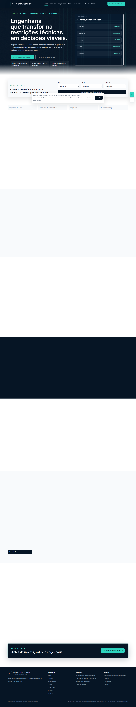

# Kairós Engenharia

## Objetivo do projeto

Site institucional da Kairós Engenharia, com apresentação profissional de engenharia, regulação e inteligência energética.

## Problema que resolve

Organiza o posicionamento técnico da marca em uma presença pública clara, acessível e verificável.

## Demonstração visual




## Tecnologias utilizadas

- Astro
- TypeScript
- Tailwind CSS
- Vitest
- Playwright
- GitHub Actions
- GitHub Pages

## Recursos principais

- Página institucional responsiva
- Conteúdo técnico de marca
- Estrutura estática com build Astro
- Scripts de auditoria, testes e validação de links

## Acesso público

GitHub Pages: https://luscaarmstrong1.github.io/kairos-engenharia/

## Como executar localmente

Pré-requisitos: Node.js compatível com o projeto e o gerenciador indicado pelo lockfile (`package-lock.json` ou `pnpm-lock.yaml`).

```bash
npm install
npm run build
```

Quando houver scripts específicos no `package.json`, use também `npm run dev`, `npm run test`, `npm run lint` ou os comandos equivalentes documentados no próprio arquivo.

## Estrutura do projeto

- `src/`, `app/` ou `apps/`: código da interface, conforme o framework do repositório.
- `public/`: assets estáticos publicados com a aplicação.
- `docs/screenshots/`: capturas reais da página publicada.
- `.github/workflows/`: automações de build/deploy quando presentes.
- `scripts/`: rotinas auxiliares de build, auditoria ou validação quando presentes.

## Limitações e avisos técnicos

Este repositório é uma demonstração técnica ou produto em evolução. O conteúdo não substitui projeto executivo, estudo de conexão, validação regulatória, parecer técnico, proposta comercial definitiva ou análise jurídica. Funcionalidades, cálculos e textos devem ser revisados antes de uso profissional.

## Privacidade e segurança

Não inclua tokens, chaves, credenciais, dados pessoais sensíveis ou arquivos `.env` em commits. Em demonstrações públicas, use dados fictícios ou anonimizados. Quando houver `.env.example`, trate-o apenas como referência de configuração.

## Status

Site institucional em evolução.
